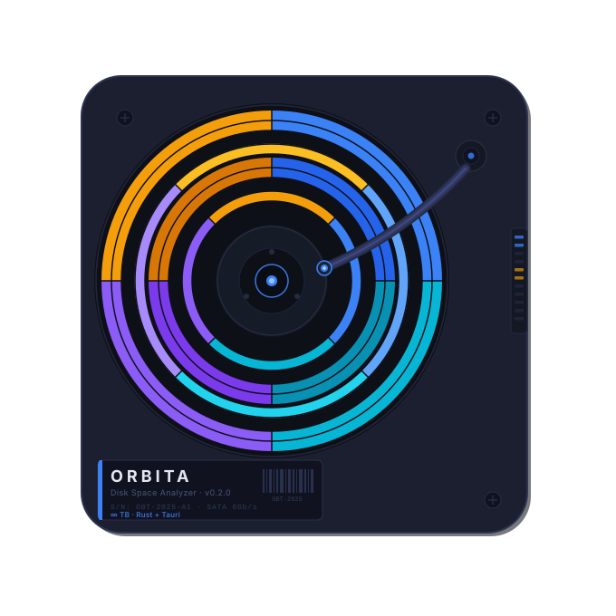

<div align="center">



# Orbita

A fast, modern disk space analyzer for macOS, Windows, and Linux. Built with Rust and SvelteKit on top of Tauri v2.

Orbita visualizes your disk usage as an interactive sunburst chart, lets you drill into folders, move files to trash, and export scan results — all from a native desktop app with a minimal, transparent UI.

[](LICENSE)
[](https://tauri.app)
[](https://svelte.dev)
[](https://www.rust-lang.org)
[](https://github.com/arelove/infinity-loop/releases)

[](https://x.com/intent/tweet?text=Check%20out%20Infinity%20Loop%20%E2%80%94%20an%20AI%20knowledge%20graph%20explorer%20built%20with%20Tauri%20%2B%20Svelte%20%2B%20Rust%20%F0%9F%94%8D%E2%9C%A8%20https://github.com/arelove/infinity-loop)
[](https://www.reddit.com/submit?title=Infinity%20Loop%20%E2%80%94%20AI%20knowledge%20graph%20explorer%20built%20with%20Tauri%20%2B%20Rust&url=https://github.com/arelove/infinity-loop)
[](https://t.me/share/url?url=https://github.com/arelove/infinity-loop&text=Infinity%20Loop%20%E2%80%94%20AI%20knowledge%20graph%20explorer)

</div>

---

## Features

- **Interactive sunburst chart** — built with D3 v7, shows the full directory tree at a glance
- **Real-time scan progress** — streamed directly from the Rust backend as pdu processes files
- **Scan history** — persists the last 50 scanned paths with timestamps and sizes
- **Export to CSV / JSON** — saves the full directory tree with per-entry sizes
- **Move to trash** — safe deletion with system-directory protection on all platforms
- **Reveal in Finder / Explorer / Files** — opens the parent folder with the item selected
- **Custom titlebar** — native window controls on macOS, custom on Windows/Linux
- **Transparent window** — glass-style UI with deep dark background; Linux falls back to solid
- **File type icons** — over 900 file type icons via vscode-icons

---

## Stack

| Layer | Technology |
| --- | --- |
| Frontend | SvelteKit 2, Svelte 5 (runes) |
| Styles | Tailwind CSS 3 |
| Chart | D3 v7 (sunburst) |
| Desktop shell | Tauri v2 |
| Scan engine | [parallel-disk-usage](https://github.com/KSXGitHub/parallel-disk-usage) (sidecar) |
| Rust deps | sysinfo 0.32, tauri-plugin-shell, trash 3, regex |

---

## Requirements

- [Node.js](https://nodejs.org) 18+
- [Rust](https://rustup.rs) stable toolchain
- Tauri v2 prerequisites — see the [Tauri docs](https://v2.tauri.app/start/prerequisites/) for your OS

---

## Getting started

```bash
# Install Node dependencies
npm install

# Start in development mode (hot-reload)
npm run tauri dev

# Build for production
npm run tauri build
```

The dev server runs on port `9034`. Tauri picks it up automatically via `devUrl` in `tauri.conf.json`.

### pdu sidecar

The scan engine is `pdu` ([parallel-disk-usage](https://github.com/KSXGitHub/parallel-disk-usage)), shipped as a prebuilt sidecar binary for each platform. The binaries live in `src-tauri/bin/` and are declared in `tauri.conf.json`:

```json
"externalBin": ["bin/pdu"]
```

Prebuilt binaries are included for:

| Platform | File |
| --- | --- |
| Linux x86_64 | `pdu-x86_64-unknown-linux-gnu` |
| macOS x86_64 | `pdu-x86_64-apple-darwin` |
| Windows x86_64 MSVC | `pdu-x86_64-pc-windows-msvc.exe` |

To build them yourself, trigger the `Build pdu binaries` workflow in GitHub Actions (`.github/workflows/build-pdu.yml`), or run:

```bash
cargo install parallel-disk-usage --target <your-target> --root ./out
```

---

## Project structure

```text
src/
  routes/
    +layout.svelte        # App shell: splash screen, TitleBar, OS detection
    +layout.ts            # SPA mode (prerender = false, ssr = false)
    +page.svelte          # Disk list
    disk/+page.svelte     # Scan view with D3 sunburst chart
    history/+page.svelte  # Scan history
  lib/
    stores.ts             # Svelte stores: scanParams, osMul, osPlatform
    types.ts              # TypeScript interfaces
    pruneData.ts          # D3 hierarchy preprocessing
    d3chart.ts            # Sunburst chart implementation
    components/
      TitleBar.svelte     # Custom window titlebar
      DiskItem.svelte     # Disk card with usage bar
      FileLine.svelte     # File/folder row with size and actions
      ParentFolder.svelte # Breadcrumb / current folder indicator
      Splash.svelte       # Animated splash screen

src-tauri/
  src/
    lib.rs                # Tauri commands: get_disks, start/stop_scanning,
                          #   show_in_folder, delete_path
    scan.rs               # pdu sidecar launch, stdout/stderr streaming
    history.rs            # Scan history persistence (JSON in app data dir)
    export.rs             # CSV and JSON export commands
    main.rs               # Entry point
  capabilities/
    default.json          # Tauri v2 permissions
  Cargo.toml
  tauri.conf.json
```

---

## Architecture notes

### Scan pipeline

1. Frontend calls `start_scanning(path, ratio)` via Tauri IPC.
2. `scan.rs` spawns `pdu` as a sidecar process with `--json-output --progress --min-ratio=<ratio>`.
3. `pdu` stdout is emitted as a `scan_completed` event carrying the full JSON tree.
4. `pdu` stderr lines are parsed with a compiled regex (`OnceLock<Regex>`) and emitted as `scan_status` events containing item count, total, and error count.
5. On `stop_scanning`, the child process is killed via the stored `CommandChild` under a `Mutex`.

When scanning the filesystem root (`/`), system directories (`/dev`, `/proc`, `/sys`, etc.) are excluded before passing paths to `pdu`.

### Delete safety

`delete_path` canonicalizes the path before acting and refuses to delete known system directories on all platforms. Files are moved to the OS trash via the `trash` crate rather than deleted permanently.

### History

Scan history is stored as JSON in the platform app data directory (`app.path().app_data_dir()`), capped at 50 entries. Rescanning the same path updates the existing entry rather than creating a duplicate.

---

## Generating icons

The app icon source is `icon.svg`. To regenerate all required sizes:

```bash
npx tauri icon icon.svg
```

This populates `src-tauri/icons/` with all formats required by macOS, Windows, Linux, and the Windows Store.

---

## Building release binaries

```bash
npm run tauri build
```

Release profile is configured for small binary size (`opt-level = "s"`, `lto = true`, `strip = true`, `codegen-units = 1`).

---

## License

Apache-2.0 license
